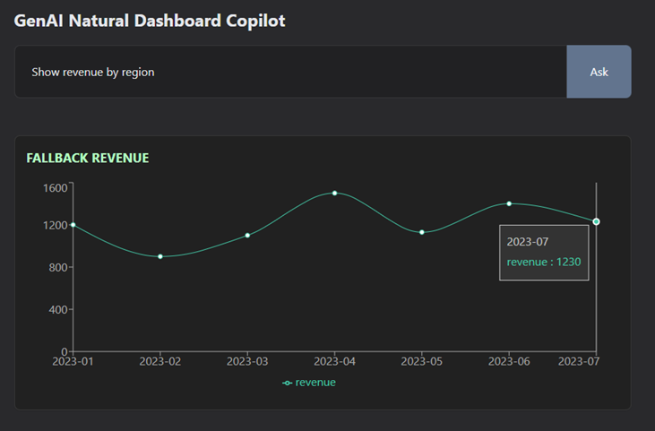

# GenAI natural language dashboard pilot



<br />

# Information

- The app generates a dynamic chart from user's written (natural language) query.
- spoken natural queries not yet implemented

Example queries:
- "Show me revenue by region for Q2"
- "Compare user signups vs churn last year"
- "Trend of daily active users in August"

# Install and usage

```bash
npm i

cp .env.example .env.local    # add OPENAI_API_KEY

npm run dev
```

# Technologies

- Next.js
- OpenAI (gpt-4o-mini / whisper-1 models)
- Recharts
- TailwindCSS
